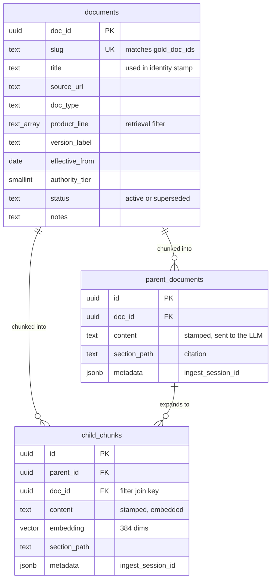
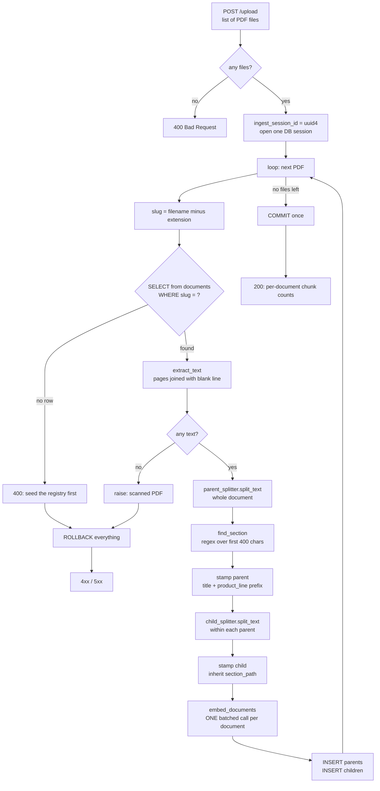
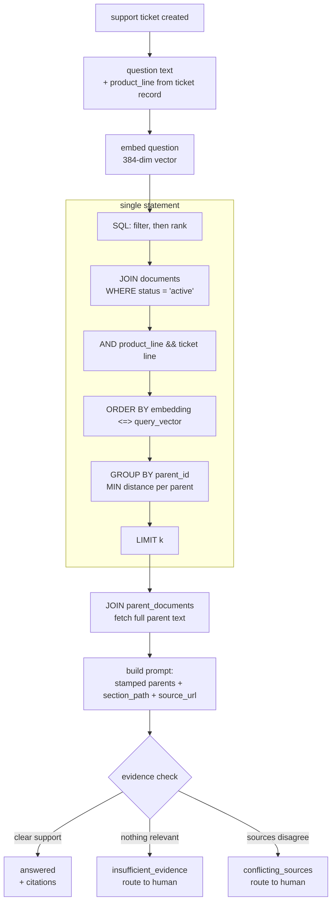
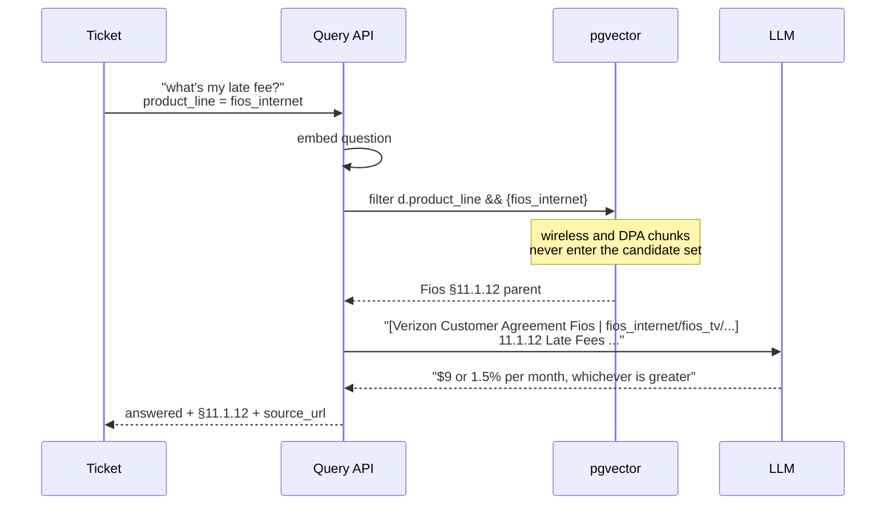

# Architecture — Verizon triage RAG

Ingest and retrieval for a multi-document policy corpus, built so that a golden-set
evaluation harness can score it. Written to be defended line by line.

---

## 1. Is the schema final?

**Final for v1** — meaning: sufficient to ingest the five documents and score
`golden_v1.jsonl` end to end. Not final forever, and it is not supposed to be.

Two things changed from my first draft, both by removing rather than adding:

| Removed | Why it went |
|---|---|
| `product_line` on `child_chunks` | Denormalised to help vector-index pre-filtering. But there is no vector index in v1, so the justification evaporated. The retrieval query already joins `documents`, so filtering on `d.product_line` costs nothing extra. |
| Page-number tracking | Cost three functions including a fragile `find()`-with-cursor loop to recover chunk offsets. `section_path` + `source_url` already lets an agent verify a figure in the source PDF. |

### Entity model



**The property that makes deferral safe:** every chunk row reaches document metadata
through one `doc_id` foreign key. Adding `effective_to`, `states`, or `content_kind`
later means altering a five-row table, not rewriting hundreds of chunk rows. That is
why "not final" is not the same as "not production-grade."

---

## 2. Ingest flow



### Step by step

**1. Generate `ingest_session_id`, open one session.**
One session for the whole batch, closed once after the loop. The original code closed
inside a per-file `finally`, so the connection died after the first PDF.

**2. Derive `slug` from the filename.**
`doc_vzw_ca_2025.pdf` → `doc_vzw_ca_2025`, which is exactly the string in
`gold_doc_ids`. No mapping table, no config file.

**3. Look up the registry row; reject if absent.**
Rejecting rather than auto-creating is deliberate. An auto-created row would have no
`product_line`, so every filtered query would silently miss that document — a
retrieval bug that looks like an embedding bug.

**4. Extract text, one string per document.**
Pages joined with `\n\n`. Without a separator, `text += page.extract_text()` fuses
page-final and page-initial words: `"...the full balance dueIf you're a Postpay
customer..."`. That corrupts the embedding *and* breaks `must_include` string matching.

One string per document rather than per page because these agreements have long atomic
sections. Splitting per page would cut the arbitration and fee provisions at page
boundaries, making some answers unretrievable no matter how good the retriever is.

**5. Split into parents, then children within each parent.**
Different sizes for different jobs: embed the small child so the vector is specific
enough to match one question; hand the LLM the whole parent so it sees the surrounding
clause. A 400-character fragment of a fee schedule is precise to retrieve and useless
to answer from.

**6. Find the section heading.**
Regex over the first 400 characters only — a heading sits at the top of its section, and
scanning the whole chunk would sometimes match the *next* heading and mislabel the
chunk. Numbered patterns first (unambiguous), title-case as fallback (looser).

**7. Stamp identity onto both parent and child.**
Prefix `[title | product_line]`. See §4 for why this is load-bearing.

**8. Embed in one batched call per document.**
Round-trip latency dominates; 500 sequential calls would take minutes.

**9. Bulk insert, then commit once for the whole batch.**
If PDF 4 fails, PDFs 1–3 roll back with it. A half-loaded corpus is the worst outcome
available: every golden-set number would be quietly wrong rather than visibly broken.

---

## 3. Query flow



### The SQL, clause by clause

```sql
WITH nearest AS (
    SELECT c.parent_id,
           MIN(c.embedding <=> CAST(:query_vector AS vector)) AS distance
    FROM child_chunks c
    JOIN documents d ON d.doc_id = c.doc_id
    WHERE d.status = 'active'
      AND (:product_line IS NULL
           OR d.product_line && ARRAY[:product_line]::text[])
    GROUP BY c.parent_id
    ORDER BY distance
    LIMIT :k
)
SELECT d.slug AS doc_id, d.title, d.source_url, d.authority_tier,
       p.section_path, p.content, n.distance
FROM nearest n
JOIN parent_documents p ON p.id = n.parent_id
JOIN documents d        ON d.doc_id = p.doc_id
ORDER BY n.distance
```

| Clause | What it does | Why it's there |
|---|---|---|
| `<=>` | pgvector cosine distance; lower is closer | Matches `vector_cosine_ops`, the opclass you'd use for HNSW later, so adding an index needs no query change |
| `d.status = 'active'` | excludes superseded documents | No-op today with one version each; in place so ingesting the 2022 agreement needs no query edit |
| `&&` | PostgreSQL array overlap | `product_line` is an array on both sides — the Fios agreement covers internet, TV and phone |
| `:product_line IS NULL OR` | unfiltered search when no product context | This is golden item gd-006: no product context means the system must ask, not merge three fee schedules |
| `GROUP BY c.parent_id` | one row per parent | Several children usually share a parent. Ungrouped, a top-10 might resolve to three distinct parents and burn the context window on repeats |
| `MIN(...) AS distance` | parent scored by its best child | The single closest child is the right signal for whether the parent is relevant |
| outer `SELECT` | full parent text + citation fields | `d.slug AS doc_id` because that is the string the golden set scores against |

**`product_line` comes from the ticket record, never from parsing the question.** That
is the whole design point: *"can I return this?"* resolves to the correct product line
without the customer naming it.

**No session filter.** `ingest_session_id` is provenance — which upload batch produced
this chunk, so a batch can be deleted or re-ingested. Filtering retrieval on the
caller's session returns zero rows and looks precisely like a broken index.

---

## 4. Worked example: why the identity stamp exists

The corpus contains three different correct answers to "what's my late fee?"

| Document | Late fee |
|---|---|
| Wireless Customer Agreement | up to 5%/month, or flat **$7**, whichever is *greater* |
| Home/Fios Customer Agreement §11.1.12 | up to 1.5%/month (18%/yr), or flat **$9**, whichever is *greater* |
| Device Payment Agreement §2 | up to 5%, or **$5**, whichever is *less*, after 15 days |



Filter and stamp do **different** jobs, and you need both:

- The **filter** decides which chunks are eligible. It is what stops a Fios ticket from
  ever seeing the wireless fee.
- The **stamp** stops misattribution *within* the context window. The raw chunk text
  reads `"...a late fee of up to 5 percent per month, or a flat $7..."` with nothing
  marking it as wireless. The moment two similar chunks legitimately co-occur — a
  customer with both a mobile line and device financing, say — the model needs the text
  itself to say which is which.

Golden items gd-003 through gd-008 exist to make a regression here fail loudly. Each
carries `must_not_include` with the *other* products' figures, so quoting `$9` to a
wireless ticket is a scored failure rather than a plausible-looking answer.

---

## 5. Interview cross-questions

| Question | Answer |
|---|---|
| Why parent/child instead of one chunk size? | Retrieval and generation want different granularity. Embed small for vector specificity, return large so the LLM sees the whole clause. |
| Why no vector index? | IVFFlat learns centroids at `CREATE INDEX` time via k-means, so building it on an empty table produces nothing usable. And `lists=100` implies ~10k rows; five PDFs give ~400–800, so with default `probes=1` a query scans ~1% of an already tiny table. Exact scan is sub-millisecond here and gives guaranteed 100% recall — which means any golden-set miss is provably chunking or embeddings, never approximation error. Add HNSW around 50k children and re-run the frozen set to measure what approximation costs. |
| Why is `product_line` on `documents` and not on chunks? | Single source of truth, and the retrieval query already joins `documents` for title and URL, so the filter is free. I had denormalised it for index pre-filtering, then removed it when I dropped the index — the justification went with it. If HNSW pre-filtering later measures badly, denormalising becomes a decision backed by numbers. |
| Why keep `doc_id` on `child_chunks` then — isn't that redundant with the parent? | Retrieval filters on children, because children carry the embedding. Without `doc_id` there, every query needs child → parent → documents, a two-hop join in the hot path. |
| Why a `slug` as well as a UUID primary key? | `doc_id` is regenerated on every re-ingest. If `gold_doc_ids` referenced UUIDs, a re-ingest would break every reference and recall would read 0 while looking like a retriever regression. |
| Why the stamp if you already filter? | Filter decides eligibility; stamp prevents misattribution once similar chunks share a context window. Concrete case: $7 / $9 / $5 late fees whose raw text is nearly identical. |
| Why `GROUP BY parent_id`? | Sibling children collapse to the same parent. Ungrouped, a nominal k=10 can resolve to 3 unique parents and waste most of the context window. |
| Why commit once for the batch? | A half-loaded corpus silently skews every eval number. Visible failure beats quiet wrongness. |
| Why did you drop page numbers? | Recovering chunk offsets from `split_text` required a `find()`-with-cursor loop I couldn't defend. `section_path` + `source_url` already supports verification. I'd add pages back with a parser that yields offsets natively. |
| `section_path` is nullable — isn't that sloppy? | It comes from regex heuristics that won't match every chunk. `NOT NULL` would force a wrong value where none exists. Recall is scored on `doc_id`, so a missing heading costs a citation, not a metric. |
| What breaks first at scale? | Exact scan, around low tens of thousands of children. Then HNSW plus a re-measured baseline. Second is the mixed-authority IPI brochure — if section-level authority becomes necessary, it needs splitting into two registry rows. |

---

## 6. Deliberately deferred

| Deferred | Add it when | Cost to add |
|---|---|---|
| `effective_from` / `effective_to` / `status` on chunks | A second version of any document is ingested | Columns exist on `documents`; denormalise only if the join measures slow |
| `authority_tier` in ranking | Implementing `conflicting_sources` resolution | Already selected in the retrieval query, just unused |
| `states` array | State-specific clauses matter (golden item gd-050, Illinois PLPA) | New column on `documents` |
| `content_kind` | The surcharge items (gd-022 → gd-025) start failing | New column; tells you whether a miss is chunking or retrieval |
| HNSW index | ~50k children | One `CREATE INDEX`; query needs no change |
| Reranking / hybrid search | **After** a baseline exists | — |

Last item is the important one. Nothing on this list gets built before
`golden_v1.jsonl` produces a number, because without a baseline there is no way to say
what any of it bought.

---

## 7. Run order

1. Apply `migration_001.sql`
2. Seed `documents` from `documents_seed.json`
3. Rename the five PDFs to `<slug>.pdf`
4. `POST /upload` with all five
5. Check the returned per-document counts — if `doc_vzw_ipi_2025` doesn't produce
   noticeably more chunks than `doc_vzw_ca_2025`, extraction dropped the plan-info
   section, which is the only source for gd-020 through gd-029
6. Run the golden set, record the baseline, commit it to the repo